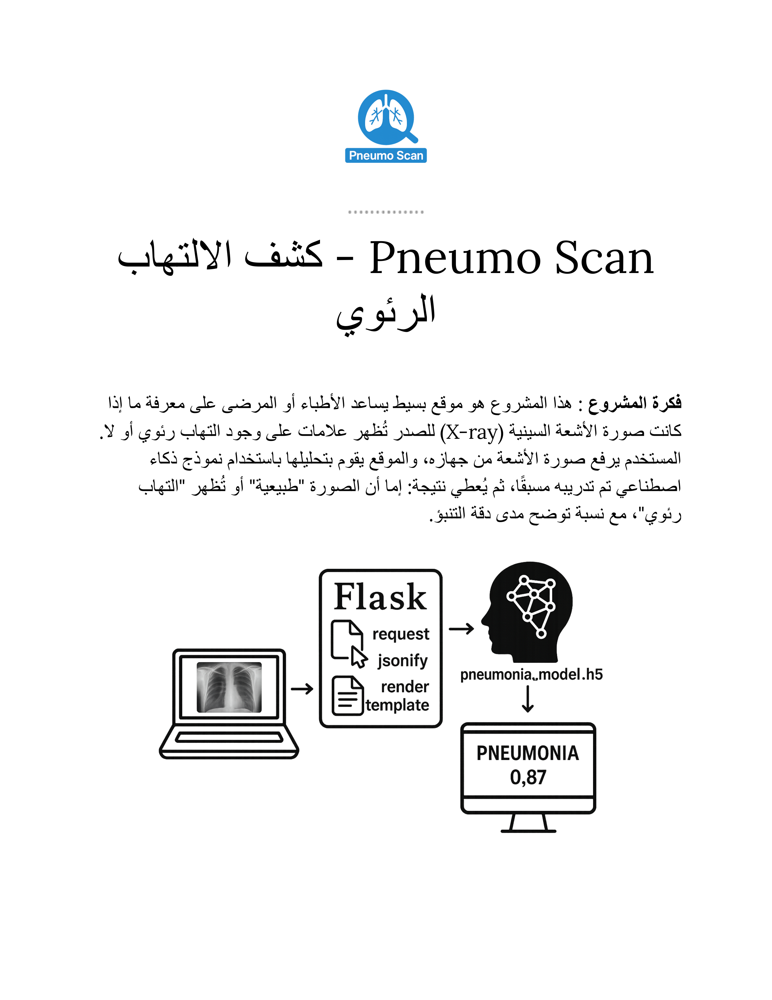

# AI Pneumo Scan

AI Pneumo Scan is a web and mobile-based pneumonia detection app that uses deep learning to analyze chest X-ray images.



## 🔍 Features
- Upload a chest X-ray and get a real-time diagnosis.
- Detects **Pneumonia** vs **Normal**.
- Returns a confidence score for better clarity.

## 🛠️ Tech Stack
- **Backend**: Python, Flask
- **Mobile**: Kotlin (Android)
- **AI Model**: Trained using Keras and TensorFlow

## 📦 Installation

```bash
git clone https://github.com/Mohsen-rm/AI-Pneumo-Scan.git
cd AI-Pneumo-Scan
pip install -r requirements.txt
python server.py
